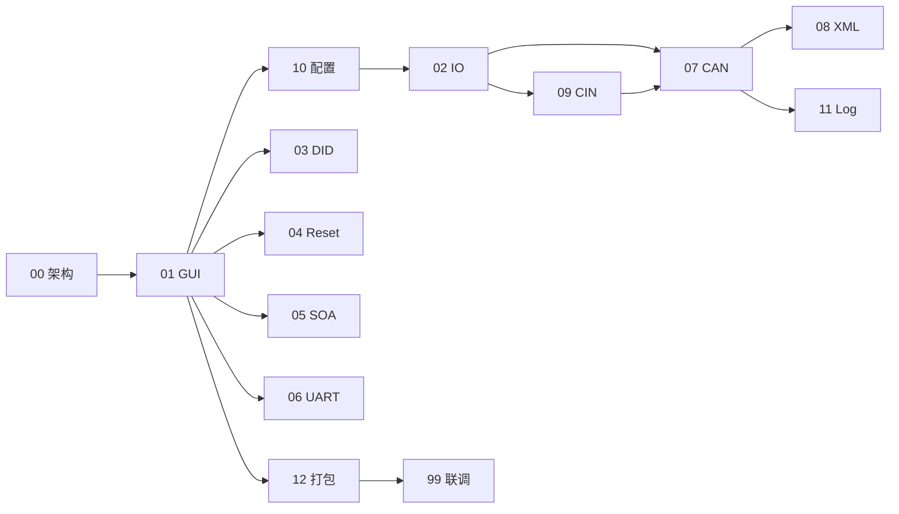

# 模块培训讲义 — 分册目录

> 与 `docs/验收清单说明.md` 一一对应。  
> **工程根目录**：`python/release_02_1/`  
> **建议学习方式**：按编号 **00 → 01 → … → 12** 顺序阅读；每册含 checklist、口语讲解、逐文件说明、流程、客户常问、演示建议。

---

## 培训总表

| 序号 | 文件 | 主题 | 建议时长 |
|------|------|------|----------|
| 00 | [00-整体架构导读.md](./00-整体架构导读.md) | 开场：分层、一键生成、三域编排 | 0.5h |
| 01 | [01-前端GUI模块.md](./01-前端GUI模块.md) | 浏览器界面、路由、Tk 弹窗、一键运行 | 2～2.5h |
| 02 | [02-IO-Mapping模块.md](./02-IO-Mapping模块.md) | IO 对照表、嵌入 CAN/CIN 翻译 | 1～1.5h |
| 03 | [03-DID-Config模块.md](./03-DID-Config模块.md) | DIDConfig.txt、字段布局 | 1h |
| 04 | [04-Reset-DID模块.md](./04-Reset-DID模块.md) | DIDInfo.txt、车型复位值 | 1h |
| 05 | [05-SOA通信矩阵模块.md](./05-SOA通信矩阵模块.md) | Node .can + 两个 SOA .cin | 1.5h |
| 06 | [06-串口UART模块.md](./06-串口UART模块.md) | Uart.txt（仅中央域） | 1h |
| 07 | [07-CAN文件生成模块.md](./07-CAN文件生成模块.md) | 核心：用例 Excel → .can + Master | 2.5～3h |
| 08 | [08-XML文件生成模块.md](./08-XML文件生成模块.md) | 用例索引 XML（不翻译步骤） | 1h |
| 09 | [09-CIN文件生成模块.md](./09-CIN文件生成模块.md) | Clib → .cin，先于 CAN | 1.5h |
| 10 | [10-工程配置保存导入模块.md](./10-工程配置保存导入模块.md) | 三 INI、界面↔配置、预设 | 1.5～2h |
| 11 | [11-Log日志模块.md](./11-Log日志模块.md) | 时间戳 log 目录、排错 | 1h |
| 12 | [12-打包模块.md](./12-打包模块.md) | build_exe.py、EXE 部署 | 0.5～1h |
| 99 | [99-附录-联调与速查.md](./99-附录-联调与速查.md) | 联调演示、一页纸速查 | 0.5h |

**合计建议**：约 2～3 天（含演示与答疑）。

---

## 关联阅读顺序（知识依赖）

- **模块 7（CAN）** 与 **2（IO）、9（CIN）** 强相关，建议连续学。  
- **模块 10（配置）** 建议在学完 **01 GUI** 后尽早学，后面各生成器都依赖 INI。  
- **模块 11（日志）** 可在跑通一次全链路后再学，便于对照真实 log 目录。

---

## 与总文档的关系

- 原合并版：[../模块培训讲义.md](../模块培训讲义.md)（现为**索引页**，详细内容以本目录分册为准）。  
- 验收对照：[../验收清单说明.md](../验收清单说明.md)。

---

## 每册文档结构（统一模板）

1. **本模块要培训的内容** — 讲师 checklist，可打印勾选  
2. **代码位置总览（本模块「小地图」）** — **培训先讲这张表**：路径 + 一句话职责 + 主要产出  
3. **先用大白话讲清楚** — 给客户的第一段话术  
4. **整体分工 / 谁触发** — 流程图或表格  
5. **逐文件讲解** — 每个 `.py`：干什么、关键类/方法、口语解释  
6. **完整处理流程** — 逐步顺序  
7. **配置键、输入输出**  
8. **客户常问问题（备答）**  
9. **演示建议 + 预计时长**  
10. **上一册 / 下一册** 导航链接  
